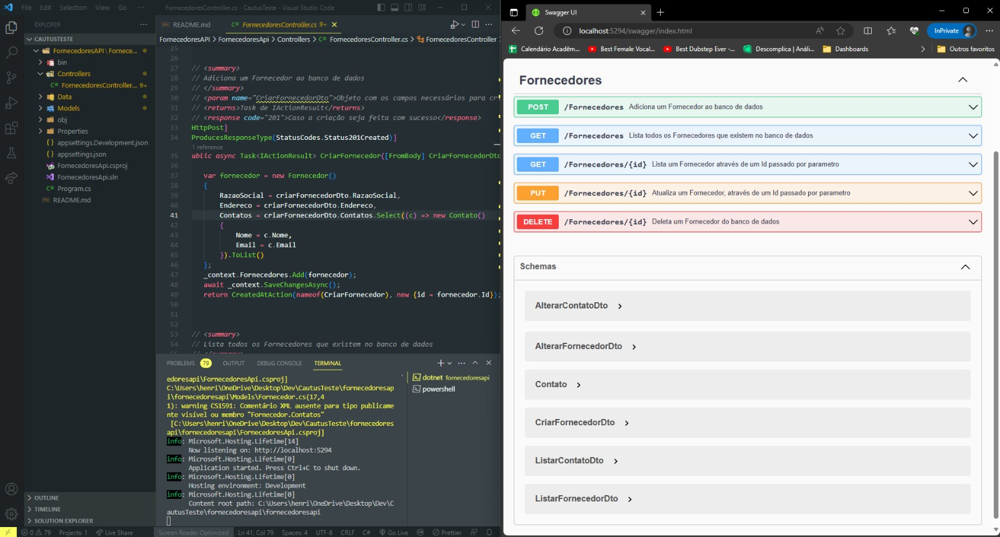

<h1 align="center">
    Sistema de Controle de Fornecedores
</h1>
    
<h1>
    
</h1>

# Indice

## 🔖&nbsp; Sobre

Este projeto  é um sistema que foi desenvolvido a fim de testar habilidades ASPNET.CORE e desenvolvimento de API com a linguagem C#

---

## 🚀 Tecnologias utilizadas

O projeto foi desenvolvido utilizando as seguintes tecnologias:

- [.NET ASP.Net Core](https://learn.microsoft.com/pt-br/aspnet/core/?view=aspnetcore-7.0)
- [EntityFramework](https://learn.microsoft.com/pt-br/ef/)
- [SQLServer](https://learn.microsoft.com/pt-br/sql/?view=sql-server-ver16)
- [BeekeeperStudio](https://www.beekeeperstudio.io/)
- [Insomnia](https://insomnia.rest/download)

## Dica: você pode utilizar o software de sua preferência para manipular e visualizar o banco de dados.
## Eu utilizei o Beekeeper Studio por gosto pessoal.

# Utilizei o Insomnia e swagger para realizar as requisições, fique a vontade para testar onde preferir.  

---

## 🗂 Como baixar o projeto

```bash

    # Clonar o repositório
    $ git clone https://github.com/HenriqueGanz/FornecedoresApi.git

    # Download
    $ Caso prefira você pode baixar a pasta diretamente 

    # Entrar no diretório
    $ cd fornecedoresapi

    # Instalar as dependências
    $ dotnet restore

    # Caso precise Executar os comandos para instalar os pacotes necessários:

    $ dotnet add package Microsoft.EntityFrameworkCore --version 6.0.10

    $ dotnet add package Microsoft.EntityFrameworkCore.Tools --version 6.0.10

    $ dotnet add package Pomelo.EntityFrameworkCore.MySql --version 6.0.2


    # Execute o comando para instalar o dotnet ef tools:
    $ dotnet tool install --global dotnet-ef

    #Execute o comando de criação de migration:
    $ dotnet ef migrations add TabelaFornecedores

    #Aplique as mudanças no banco de dados:
    $ dotnet ef database update

    # Iniciar o projeto
    $ dotnet run

    # Acesse a Url na qual o projeto foi inicializado e adicione /swagger, exemplo:
    $ http://localhost:5294/swagger
```

---

Desenvolvido por Henrique Ganz
